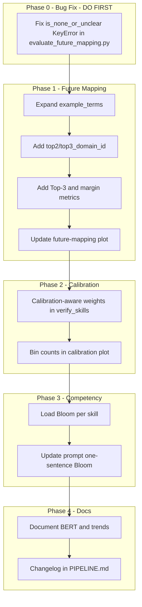

# Plan: Improve Pipeline Results (Consolidated)

**Merged from:** improve_pipeline_results_bfd34207.plan.md + plan_review_issues_to_address_and_clarifications_3c8d2cf3.plan.md

---

## Scope

1. **Future-domain mapping** (Top-1 ~28% vs target 60%; low margin)
2. **Calibration** (semantic_density, context_agreement miscalibrated)
3. **Documentation** (BERT standalone, trend limitations)

**Not in scope:** fine-tuning embeddings, trend improvements (depends on more time-series data).

---

## 0. Bug Fix: Phase 2 Dashboard — MUST FIX FIRST (blocks run Phase 2 from dashboard)

**Error when running Phase 2 from dashboard:**
```
KeyError: 'is_none_or_unclear'
File "evaluate_future_mapping.py", line 95, in evaluate
    mask = (results_df["is_none_or_unclear"] == True)
```

**Cause:** The `not_in_mapping` branch (lines 71–77) omits `is_none_or_unclear`. When any/all gold items are unmatched (e.g. skills in gold differ from mapping), `results_df` lacks the column and line 95 raises KeyError.

**Action:** Add `is_none_or_unclear: True` to the `not_in_mapping` result dict (exclude from evaluable).

```python
results.append({
    "item": key, "true_domain": true_id,
    "predicted_domain": "", "correct": False,
    "is_none_or_unclear": True,
    "margin": 0.0, "status": "not_in_mapping",
})
```

**File:** [evaluate_future_mapping.py](evaluate_future_mapping.py)

---

## 1. Future-Domain Mapping Improvements

### 1.1 Richer Domain Representation

Expand `example_terms` in [ingest_future_domains.py](ingest_future_domains.py) (`WEF_DOMAINS`, `ONET_DOMAINS`, etc.) with 5–15 additional terms per domain.

### 1.2 Top-3 Accuracy and Margin Stratification

- **future_weight_mapping.py:** Add `top2_domain_id`, `top3_domain_id` (and optionally `top2_similarity`, `top3_similarity`). Use `np.argsort(sim_mat, axis=1)[:, -2]` and `[:, -3]`. Guard with `sim_mat.shape[1] >= 2` for top2 and `>= 3` for top3; use empty string or NaN when fewer domains.
- **evaluate_future_mapping.py:** Compute `top3_accuracy`; add `top1_accuracy_high_margin` and `top3_accuracy_high_margin`; add `--margin_threshold` (default 0.05).
- **plot_scientific_analysis.py:** Display Top-3 accuracy and mean margin.

### 1.3 Optional

Exclude low-margin items from evaluation (Section 1.3 in original plan). Not in todos.

---

## 2. Calibration Improvements

### 2.1 Calibration-Aware Weighting in verify_skills

- Load `parameter_validation_report.json` from **output_dir only**.
- Map Brier: `confidence_score` → W_CONFIDENCE, `semantic_density` → W_DENSITY, `context_agreement` → W_AGREEMENT. Keep W_FREQUENCY fixed.
- Compute `w_i = 1 / (1 + brier_i)`, normalize. Fallback to fixed weights if report missing (Phase 1 never runs validate_parameters).

### 2.2 Per-Bin Counts in Calibration Plot

Annotate calibration curve points with `bin_counts` (e.g. "n=12") from the report.

---

## 3. Documentation

- BERT standalone limitation in RESEARCH_QUESTIONS.md
- Trend detection troubleshooting in PIPELINE.md or SCIENTIFIC_METHODOLOGY.md
- Improvement changelog in PIPELINE.md

---

## 4. Competency Statement Formulation

### 4.1 Bloom Taxonomy Alignment

- Load Bloom from verified_skills.csv / advanced_skills_human_filtered.csv / advanced_skills.csv.
- Build skill-to-bloom map; extend `format_skill` in `build_prompt`.
- For multiple rows per skill: use mode or first non-N/A. If `bloom` absent, omit from prompt.

### 4.2 One-Sentence, Clear, Measurable, Operational

- Change description to one sentence.
- Add BLOOM ALIGNMENT rule (highest level among related skills).
- Add example and guidance.

---

## Implementation Order

**Start with Phase 0** — the Phase 2 dashboard bug must be fixed first or "Run Phase 2" from the dashboard will always fail with `KeyError: 'is_none_or_unclear'`.



---

## Implementation Checklist

1. **future_weight_mapping.py:** Guard top2/top3 with shape checks; empty string or NaN when unavailable.
2. **verify_skills.py:** Load report from output_dir only; map context_agreement → W_AGREEMENT; W_FREQUENCY fixed.
3. **generate_competencies.py:** Load bloom; skill_bloom_map; handle missing bloom; mode/first non-N/A for duplicates.
4. **Gold (optional):** Fix `true_domain_id: "3-Dec"` → `DEC03` in gold_future_domain.csv line 16.

---

## Testing and Validation

- Phase 1 pipeline + dashboard Phase 1
- Phase 2 from dashboard (validate_parameters, verify_skills, evaluate_future_mapping)
- Check future_mapping_evaluation_report.json, parameter_validation_report.json, verified_skills.csv
- plot_scientific_analysis.py --output_dir

**Post-implementation:**

- < 3 domains: top3 columns handled
- Phase 1 only: verify_skills uses fixed weights (no crash)
- Phase 2 dashboard: evaluate_future_mapping + calibration weights work
- Competency gen: with and without bloom column

---

## Files Summary

| Component   | Files                                                                          |
| ----------- | ------------------------------------------------------------------------------ |
| Bug fix     | evaluate_future_mapping.py                                                     |
| Future      | ingest_future_domains.py, future_weight_mapping.py                             |
| Eval/plots  | evaluate_future_mapping.py, plot_scientific_analysis.py                        |
| Calibration | verify_skills.py                                                               |
| Competency  | generate_competencies.py                                                       |
| Docs        | RESEARCH_QUESTIONS.md, SCIENTIFIC_METHODOLOGY.md, PIPELINE.md, CALCULATIONS.md |
